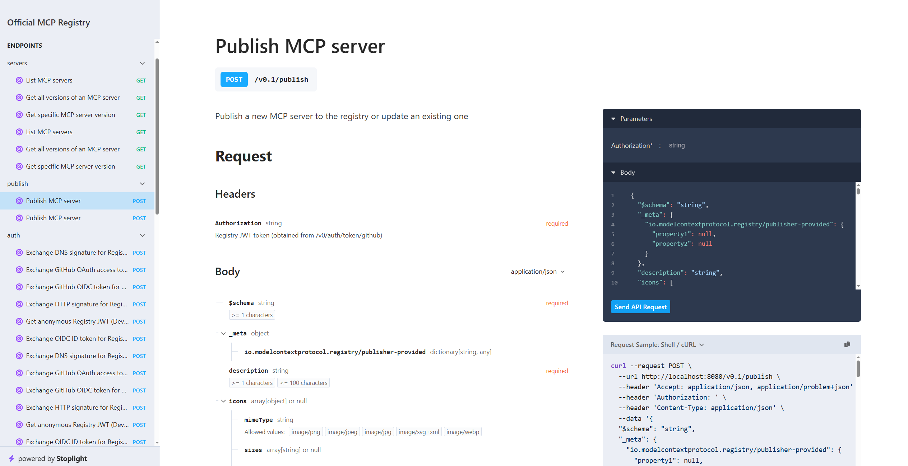

# MCP Registry Test Scripts

Testing and demonstration scripts for interacting with the MCP (Model Context Protocol) Registry. These Python scripts demonstrate how to **publish** servers to the registry and **consume** servers from the registry using the REST API.

## Features

This project provides example scripts for:

### Publishing
- **publish_server_rest.py** - Publish MCP servers to the registry using REST API
  - Validate `server.json` against MCP schema
  - Support for authentication (none/dev mode and bearer tokens)
  - Publish new servers or update existing versions
  - Verify publication success

### Consuming
- **consume_from_registry.py** - Discover and consume MCP servers from the registry
  - Search for servers by name
  - Get server details and metadata
  - List all versions of a server
  - Paginate through all servers
  - Get installation instructions

## Interactive API Documentation

The MCP Registry provides an interactive API documentation interface powered by OpenAPI/Swagger. This is the easiest way to explore and test the registry API.

**Access the docs at:** `http://localhost:8080/docs`



The interactive documentation allows you to:
- Browse all available endpoints
- View request/response schemas
- Test API calls directly from your browser
- See authentication requirements
- Explore server publishing and discovery endpoints

This is particularly useful for understanding the API before writing your own scripts or integrations.

## Usage

### Publishing a Server

Publish the example MCP Math Server to your local registry:

```bash
cd scripts
python publish_server_rest.py
```

#### Environment Variables

Configure the publisher using environment variables:

- `MCP_REGISTRY_URL` - Registry URL (default: `http://localhost:8080`)
- `MCP_AUTH_TOKEN` - Authentication token (optional for local dev)
- `MCP_AUTO_AUTH` - Auto-authenticate using `/auth/none` endpoint (default: `true`)
- `MCP_UPDATE_MODE` - Use PUT to update existing version (default: `false`)
- `MCP_SERVER_JSON` - Path to `server.json` file (default: `../mcp_server_test/server.json`)

Example:
```bash
export MCP_REGISTRY_URL="http://localhost:8080"
export MCP_AUTO_AUTH="true"
python publish_server_rest.py
```

### Consuming from Registry

Explore servers in the registry:

```bash
cd scripts
python consume_from_registry.py
```

This script demonstrates:
1. **Searching** for servers (e.g., "math")
2. **Getting** details for a specific server
3. **Listing** all versions of a server
4. **Paginating** through all available servers
5. **Getting** installation instructions

### Key Features

- **REST API Integration**: Direct HTTP requests to registry endpoints
- **Authentication Support**: Bearer tokens and dev-mode authentication
- **Schema Validation**: Validates `server.json` against official MCP schema
- **Error Handling**: Comprehensive error handling with helpful messages
- **Pretty Output**: Formatted console output for easy reading

### Project Structure

```
mcp_registry_test/
├── scripts/
│   ├── consume_from_registry.py   # Client for discovering servers
│   └── publish_server_rest.py     # Publisher for adding servers
├── .gitignore
└── README.md
```

### Prerequisites for Testing

1. **MCP Registry**: Must have the registry running locally
   ```bash
   cd registry
   make docker-up
   ```

2. **MCP Server**: For publishing tests, you need a valid `server.json`
   - Example server is in `../mcp_server_test/`
   - Or create your own following the [MCP specification](https://modelcontextprotocol.io)